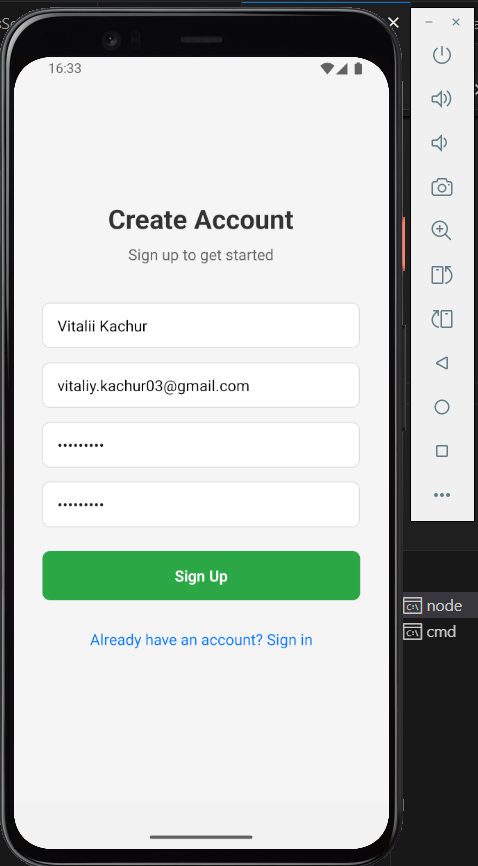
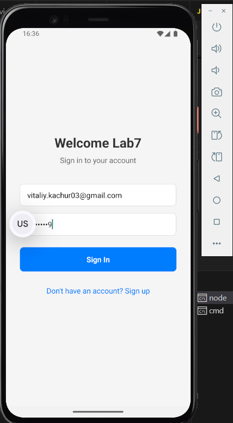
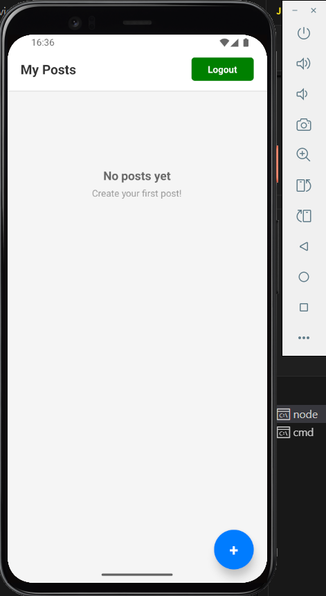
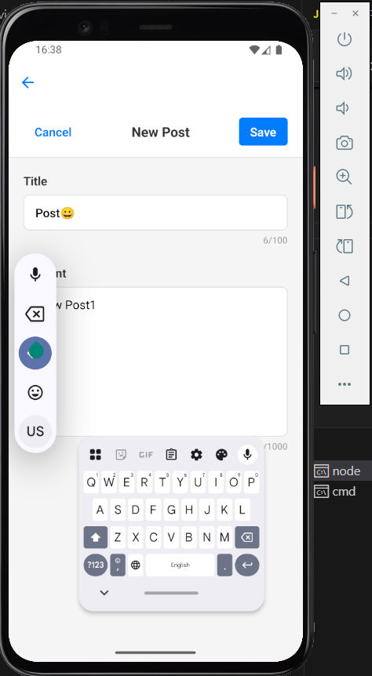
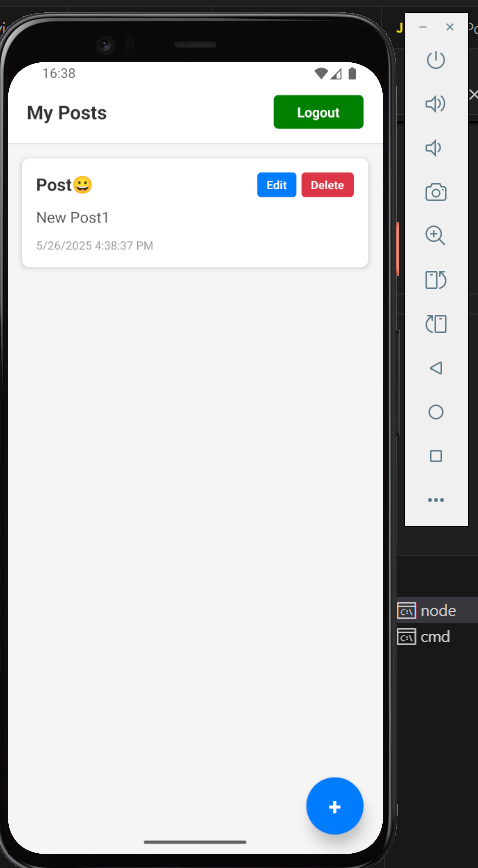
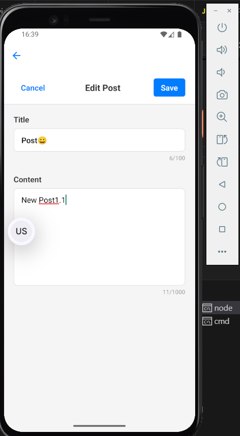
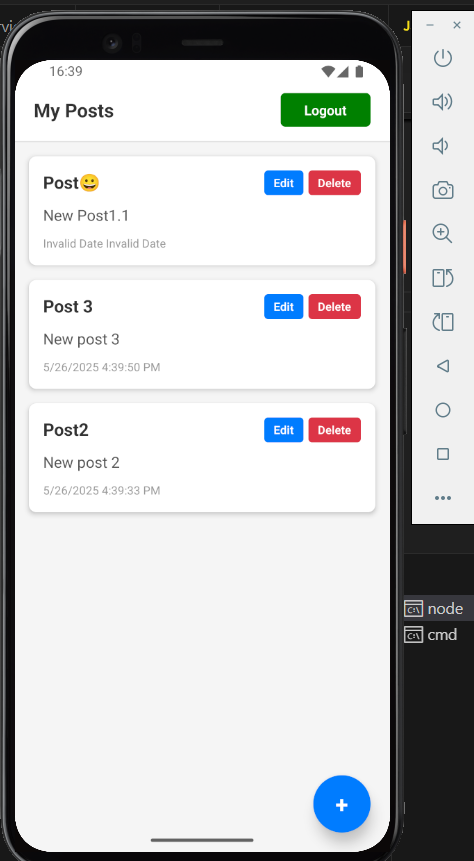
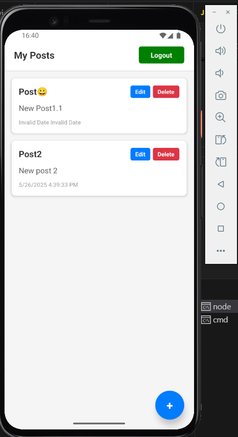
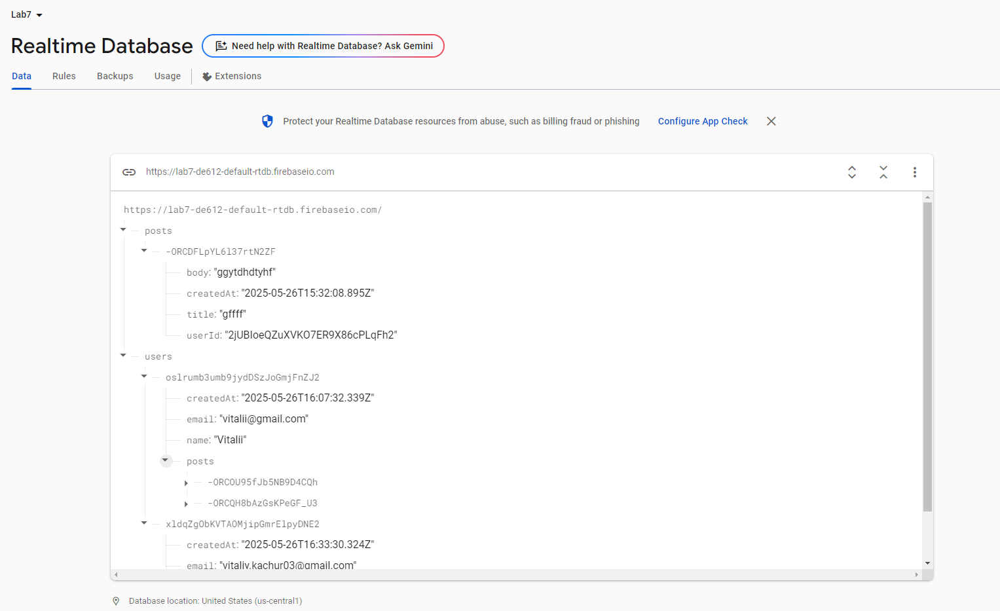
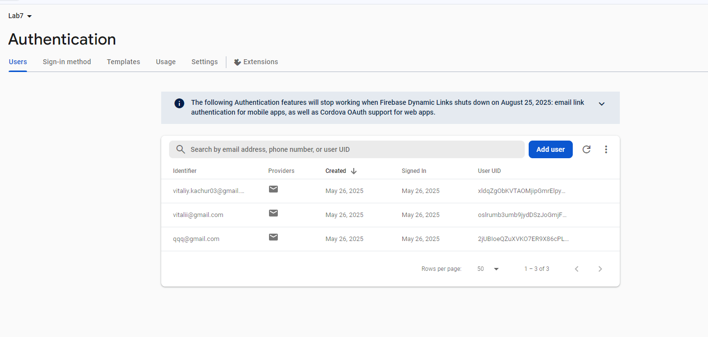

# LAB7

## Інструкції з налаштування

1. Встановіть залежності:

   ```bash
   npm install
   ```

2. Створіть проєкт у Firebase:

   - Перейдіть на [https://console.firebase.google.com/](https://console.firebase.google.com/)
   - Створіть новий проєкт
   - Увімкніть автентифікацію (Email/Password)
   - Увімкніть Realtime Database
   - Отримайте Web API Key у налаштуваннях проєкту

3. Оновіть конфігурацію Firebase:

   - Замініть `FIREBASE_API_KEY` у файлі `src/contexts/AuthContext.js`
   - Оновіть `baseURL` у `src/services/api.js` на URL вашої бази даних

4. Встановіть правила доступу до Realtime Database:

   ```json
   {
     "rules": {
       "users": {
         "$userId": {
           ".read": "$userId === auth.uid",
           ".write": "$userId === auth.uid"
         }
       }
     }
   }
   ```

5. Запустіть додаток:
   ```bash
   npx expo run:android
   ```

---

## Функціонал

- Авторизація через Firebase (вхід / реєстрація)
- Керування сесією на основі токенів
- Операції CRUD для постів
- Автоматичне оновлення токена
- Зберігання токена офлайн
- Валідація форм
- Стан завантаження
- Обробка помилок

---

## Структура проєкту

```
src/
├── contexts/
│   └── AuthContext.js          # Управління станом автентифікації
├── navigation/
│   └── AppNavigator.js         # Налаштування навігації в додатку
├── screens/
│   ├── LoginScreen.js          # Екран входу
│   ├── RegisterScreen.js       # Екран реєстрації
│   ├── Profile.js              # Профіль
│   ├── PostsScreen.js          # Список постів з можливістю CRUD
│   └── CreatePostScreen.js     # Форма створення/редагування посту
└── services/
    ├── api.js                  # Конфігурація Axios
    └── postsService.js         # Сервіс для взаємодії з API постів
```

## 📱 Скріншоти

---

## Сторінка реєстрації



## Сторінка входу



## Сторінка постів



## Додавання посту



## Відображення посту



## Редагування посту



## Відображення постів



## Видалення посту 3



## Realtime Database



## Authentication



## 🧑‍💻 Автор

**Качур Віталій Васильович**, ВТк-24-1
