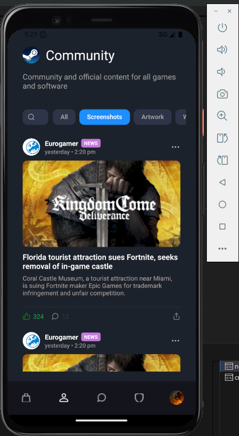
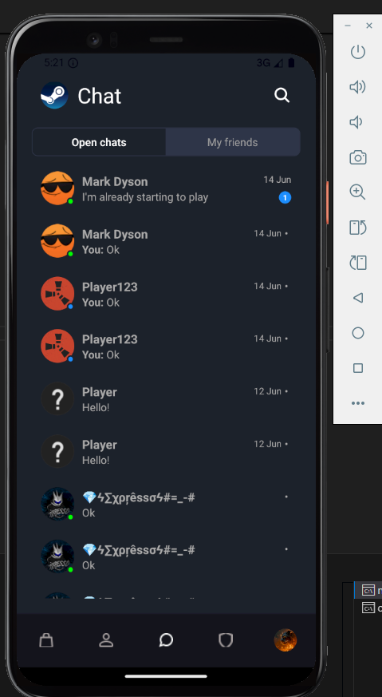
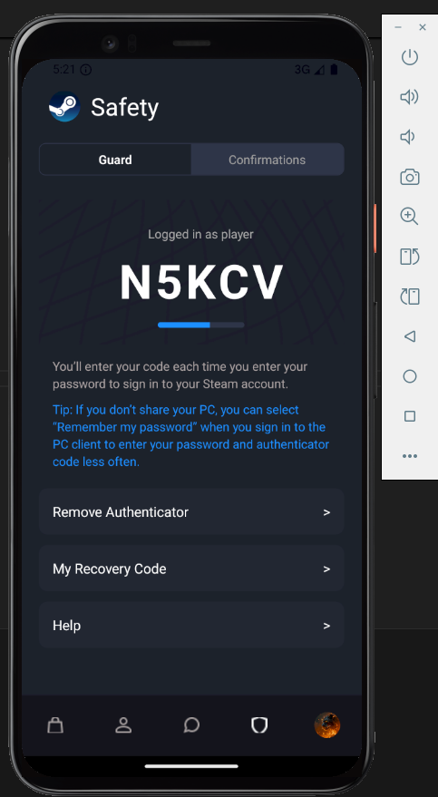
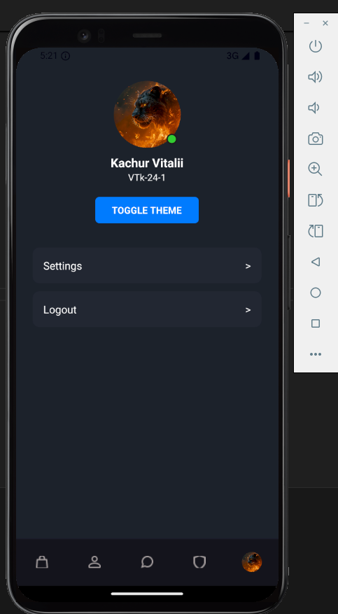
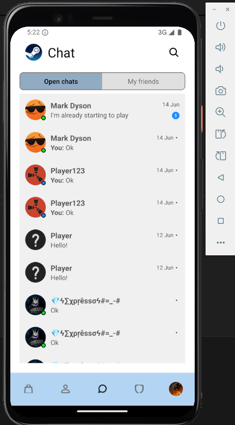
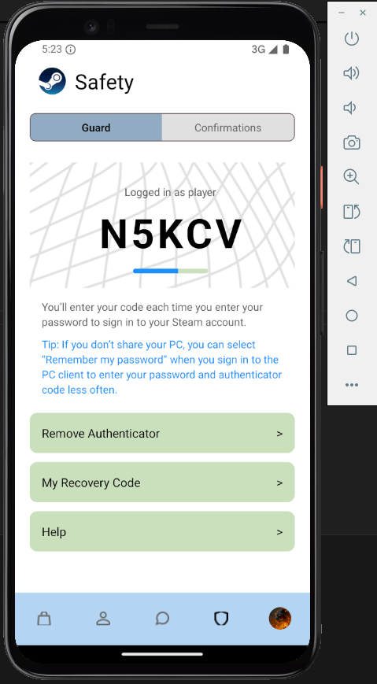
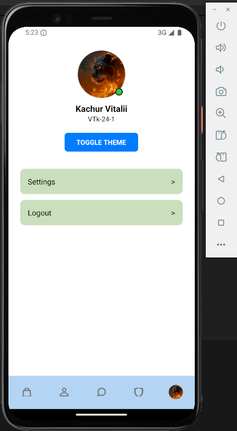

# 🎩 Steam-App (React Native)

Це мобільний застосунок, стилізований під Steam, розроблений з використанням React Native. Він підтримує темну та світлу тему, навігацію між екранами, фільтри, списки ігор, картки, чат і багато іншого.

---

## 🚀 Запуск проєкту

### 📦 Передумови

Для коректної роботи застосунку необхідно мати встановлене:

- **Node.js**
- **npm** або **yarn**
- **Expo CLI**:
  ```bash
  npm install -g expo-cli
  ```

---

### 📅 Встановлення залежностей

У кореневій директорії проєкту виконай:

```bash
npm install
```

---

### 🧰 Необхідні додаткові залежності

```bash
npm install styled-components
npm install @react-navigation/native
npm install @react-navigation/bottom-tabs
npm install react-native-screens react-native-safe-area-context react-native-gesture-handler react-native-reanimated
npm install @expo/vector-icons
npm install react-native-svg
```

---

## ▶️ Запуск застосунку

### Android:

```bash
npm run android
```

### Через Expo Go:

```bash
npx expo start
```

Після запуску скануй QR-код через додаток **Expo Go** на мобільному пристрої.

---

## 📁 Структура проєкту

```
STEAM-APP/
├── assets/                # Зображення та іконки
├── components/            # Повторно використовувані компоненти
├── navigation/            # AppNavigator з вкладками
├── screens/               # Екрани (магазин, чат, профіль тощо)
├── theme/                 # Тема (dark/light), ThemeProvider
├── App.js                 # Точка входу
├── app.json               # Конфігурація Expo
└── package.json           # Залежності
```

---

## 🎨 Тема

Підтримується темна та світла тема, що перемикається у `ProfileScreen` через кнопку **Toggle Theme**.

Використовується:

- `styled-components/native`
- `Context API`
- власний `ThemeProvider` у `theme/ThemeContext.js`

---


## 📸 Скриншоти

Скриншоти розташовано у папці `assets/`.

---












## Автор

Качур Віталій Васильович, ВТк-24-1

