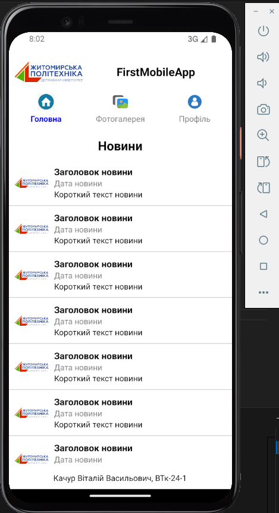
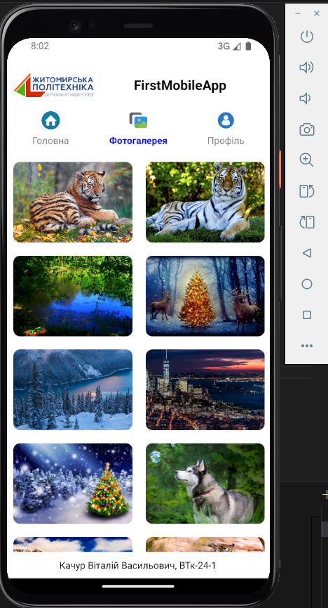
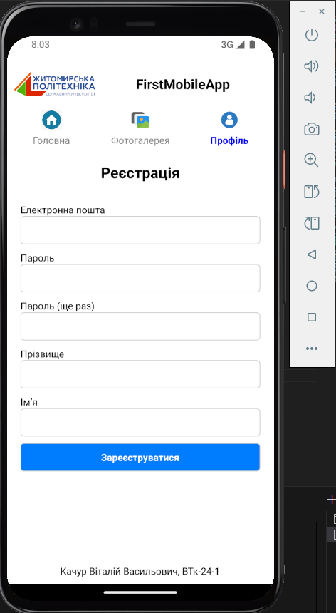

# FirstMobileApp

## Опис

FirstMobileApp - це мобільний додаток, створений за допомогою React Native. Він містить головний екран з новинами, фотогалерею та сторінку реєстрації.

## Вимоги до запуску

### 1. Встановлення Node.js та npm

Перед початком роботи необхідно встановити [Node.js](https://nodejs.org/) та npm.

### 2. Встановлення Expo CLI (за необхідності)

Якщо у вас ще не встановлений Expo, його можна встановити за допомогою команди:

```sh
npm install -g expo-cli
```

### 3. Клонування репозиторію

```sh
git clone <URL-репозиторію>
cd FirstMobileApp
```

### 4. Встановлення залежностей

```sh
npm install
```

### 5. Запуск додатку

Для запуску на емуляторі або фізичному пристрої використовуйте команду:

```sh
npx expo start
```

Або, якщо використовується `react-native` без Expo:

```sh
npx react-native run-android # для Android
npx react-native run-ios # для iOS
```

## Необхідні імпорти

Щоб додаток працював коректно, у файлі `App.js` повинні бути імпортовані наступні модулі:

```javascript
import React from "react";
import { View, Text, FlatList, Image, StyleSheet, TouchableOpacity, TextInput } from "react-native";
import { NavigationContainer } from "@react-navigation/native";
import { createStackNavigator } from "@react-navigation/stack";
```

## Структура проєкту

```
FirstMobileApp/
│-- assets/                  # Зображення та логотипи
│-- components/              # Компоненти
│-- App.js                   # Головний файл додатку
│-- package.json             # Файл залежностей
│-- README.md                # Цей файл
```

## Основний функціонал

- **Головна сторінка:** Відображає список новин.
- **Фотогалерея:** Відображає сітку зображень.
- **Сторінка реєстрації:** Форма для введення персональних даних.






## Автор

Качур Віталій Васильович, ВТк-24-1
