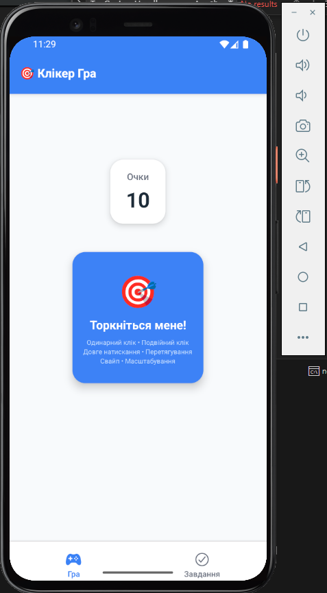
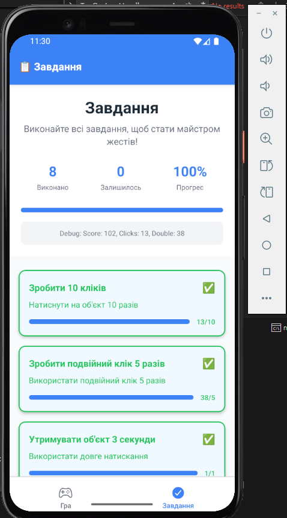

# 🎯 Gesture Game - Клікер Гра з Жестами

Мобільний додаток для навчання та практики жестів на React Native з використанням React Navigation та React Native Gesture Handler.

---

## 📱 Опис проекту

**Gesture Game** — це інтерактивна мобільна гра, розроблена для навчання та практики різних типів жестів на мобільних пристроях. Гра включає систему завдань, підрахунок очок та різноманітні види взаємодії з ігровими елементами.

### ✨ Основні функції:

- **Різні типи жестів:** одинарний клік, подвійний клік, довге натискання, перетягування, свайпи, масштабування
- **Система завдань:** 8 різних завдань для виконання
- **Підрахунок очок:** динамічна система нарахування балів
- **Прогрес-бар:** візуальне відображення прогресу виконання завдань
- **Анімації:** плавні анімації та відгуки на жести користувача

---

## 🏗️ Структура проекту

```
gesture-game/
│
├── App.js                          # Головний компонент додатку
│
├── src/
│   ├── components/
│   │   ├── GameCard.js             # Ігрова картка з жестами
│   │   └── TaskItem.js             # Компонент завдання
│   │
│   ├── screens/
│   │   ├── GameScreen.js           # Екран гри
│   │   └── TasksScreen.js          # Екран завдань
│   │
│   ├── navigation/
│   │   └── AppNavigator.js         # Налаштування навігації
│   │
│   ├── context/
│   │   └── GameContext.js          # Контекст для управління станом гри
│   │
│   └── utils/
│       └── constants.js            # Константи та початкові дані
│
├── package.json                    # Залежності проекту
└── README.md                       # Документація
```

---

## 🎮 Типи жестів

- **Одинарний клік** – базове натискання (1 очко)
- **Подвійний клік** – швидке подвійне натискання (2 очки)
- **Довге натискання** – утримування 800мс+ (5 очок)
- **Перетягування** – переміщення об'єкта по екрану
- **Свайп вправо/вліво** – швидкий рух пальцем (1-10 очок випадково)
- **Масштабування** – pinch gesture (3 очки бонус)

---

## 🚀 Інструкція запуску

### 🔧 Передумови

Переконайтесь, що у вас встановлено:

- Node.js (версія 16 або вище)
- npm або yarn
- Expo CLI
- Expo Go додаток на мобільному пристрої

### ⚙️ Кроки запуску:

**1. Клонування репозиторію**

```bash
git clone <repository-url>
cd gesture-game
```

**2. Встановлення залежностей**

```bash
npm install
# або
yarn install
```

**3. Запуск проекту**

```bash
npm start
# або
yarn start
# або
expo start
```

**4. Запуск на пристрої**

- Відскануйте QR-код через додаток Expo Go
- Або натисніть `a` для Android емулятора
- Або натисніть `i` для iOS симулятора

---

## 📦 Залежності

Основні залежності:

- `react` – Бібліотека для створення інтерфейсів
- `react-native` – Фреймворк для мобільної розробки
- `@react-navigation/native` – Навігація між екранами
- `@react-navigation/bottom-tabs` – Нижня таб-навігація
- `react-native-gesture-handler` – Обробка жестів
- `react-native-reanimated` – Анімації
- `@expo/vector-icons` – Іконки

### Встановлення залежностей

```bash
expo install react-navigation/native @react-navigation/bottom-tabs
expo install react-native-gesture-handler react-native-reanimated
expo install @expo/vector-icons
```

---

## 🎯 Завдання в грі

1. Зробити 10 кліків – Натиснути на об'єкт 10 разів
2. Зробити подвійний клік 5 разів – Подвійне натискання
3. Утримувати об'єкт 3 секунди – Довге натискання
4. Перетягнути об'єкт – Drag gesture
5. Зробити свайп вправо – Swipe right
6. Зробити свайп вліво – Swipe left
7. Змінити розмір об'єкта – Масштабування
8. Отримати 100 очок – Загальний прогрес

---

## 🔧 Технічні особливості

- **React Context** для глобального стану
- **Reanimated** для плавних анімацій
- **Gesture Handler** для складних взаємодій
- **Tab Navigation** між екранами
- **Responsive Design** для будь-яких екранів

---


## 📱 Скріншоти

- **Екран гри:** Інтерактивна картка, яка реагує на жести

---


- **Екран завдань:** Список завдань із прогрес-барами



---

## 👨‍💻 Автор

**Качур Віталій Васильович**, ВТк-24-1
